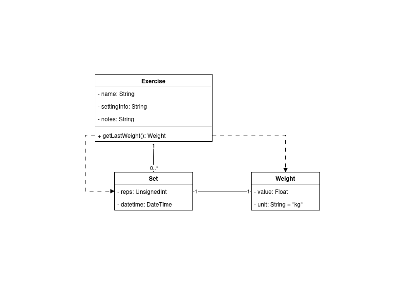
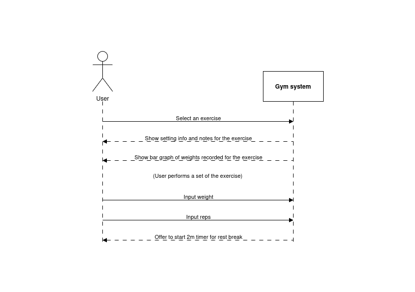

# Gym Tracker - Design Folio

## System description

The gym tracker system is a simple system for tracking progress at the gym that should be implemented as a single-page progressive web application (PWA) using pure HTML/CSS/JavaScript. It should store all data locally using `localStorage`.

### Functional requirements
- The system must allow users to create/edit/delete exercises
- Once an exercise has been created, the system must allow users to log sets of the exercise
- The system must allow users to import and export their data from/to JSON
- The system must allow users to easily start a 2-minute rest-break timer after logging a set
- The system must produce bar graphs of the weights recorded for a given exercise

## UML diagrams

### Class diagram

### Sequence diagram

The following sequence diagram shows the process of logging a set of an exercise:

