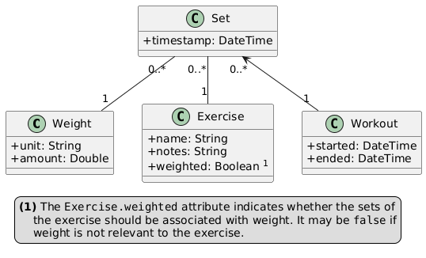
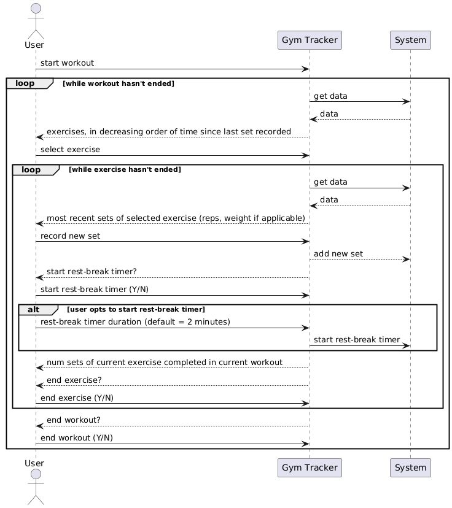

# Design folio for Gym Tracker

The Gym Tracker application should be a simple solution that allows users to track their progress at the gym. This document (and the diagrams contained within it) describes how the Gym Tracker application should be implemented.

## UML diagrams

### Class diagram

### Sequence diagram

## Implementation details

- The project must be implemented as a PWA using plain HTML/CSS/JavaScipt
- The project must store all data in local storage
    - The project must support importing/exporting data as JSON, and it should do so in line with the way previous versions have imported from/exported to JSON
- When the user records a new set (of an exercise), the system offers to start a 2-minute rest-break timer. When the timer finishes, it **must** send a notification to the user's device. If the user is accessing the system through a browser platform that doesn't support notifications, it must inform the user that they won't receive a notification.
    - Also the timer **must** go finish at the correct time regardless of what other processes are operating within the user's device; under no cirmumstances should the timer freeze and become unresponsive, and if it does, it should still be there after refreshing the page